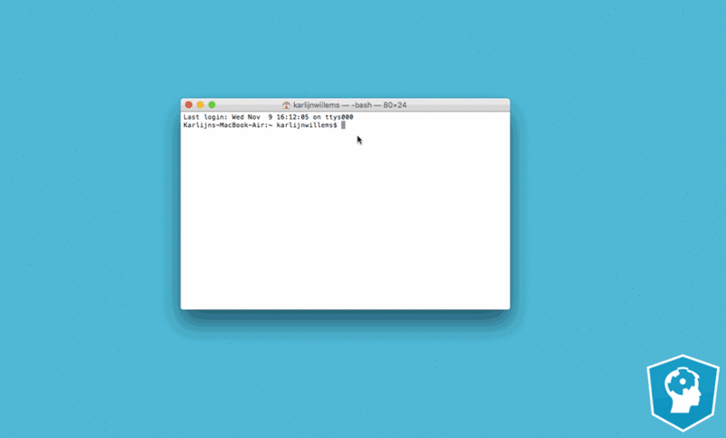

# What is Jupyter Notebook?
Anaconda provides Jupyter Notebook - is one of the popular data science tools. 

As a server-client application, the Jupyter Notebook App allows you to edit and run your notebooks via a web browser that contains both code and rich text elements, such as figures, links, equations etc.

Because of the mix of code and text elements, these documents are the ideal place to bring together an analysis description and its results as well as they can be executed perform the data analysis in real time.

# How do I start Jupyter Notebook?
Run the following command to open up the application:
```
jupyter notebook
```
Then you'll see the application opening in the web browser on the following address: http://localhost:8888. This all is demonstrated in the gif below:


