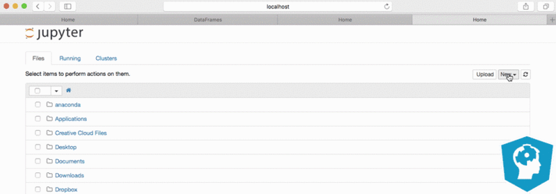

# What is Jupyter Notebook?
Anaconda provides Jupyter Notebook - is one of the popular data science tools. 

As a server-client application, the Jupyter Notebook App allows you to edit and run your notebooks via a web browser that contains both code and rich text elements, such as figures, links, equations etc.

Because of the mix of code and text elements, these documents are the ideal place to bring together an analysis description and its results as well as they can be executed perform the data analysis in real time.

# How do I start Jupyter Notebook?
Run the following command to open up the application:
```
jupyter notebook
```
Then you'll see the application opening in the web browser on the following address: http://localhost:8888. This all is demonstrated in the gif below:


## Tabs
* Files Tab : The `Files` tab is where all your files are kept.
* Running Tab: `Running` tab keeps track of all your processes.
* Cluster Tab:  `Clusters` is provided by IPython parallel, IPython's parallel computing framework. It allows you to control many individual engines, which are an extended version of the IPython kernel.

## Making a New Notebook
You can easily do this by clicking on the `New button` in the `Files tab`.

You see that you have the option to make a regular text file, a folder, and a terminal.

Lastly, you will also see the option to make a Python 3 notebook. 

You will immediately see the notebook name, a menu bar, a toolbar and an empty code cell:


## Import Libraries
You can immediately start with importing the necessary libraries for your code. 

After, you can add, remove or edit the cells according to your needs. And don't forget to insert explanatory text or titles and subtitles to clarify your code! That's what makes a notebook a notebook in the end. 


## Saving your work
You can make a copy or download a copy as a notebook, python, html etc.

Just click on the `File` menu on the top left corner that will open up some options.
